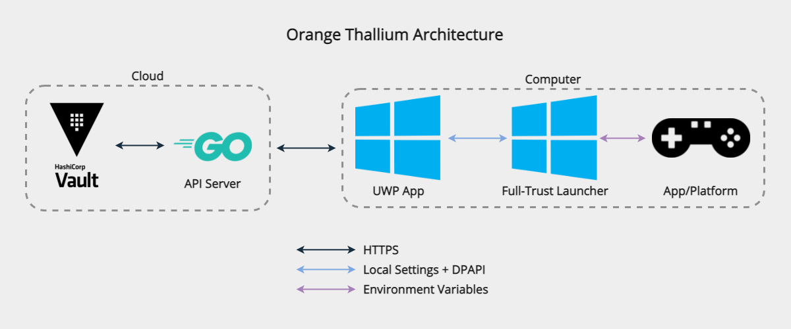

# Orange Thallium (Client)

An esports credential management system. This repository is the client, the server
can be found [here](https://github.com/bmhs-tsa/orange-thallium-server).

## Architecture

## Usage

### Configuring the client
1. Launch the Orange Thallium client
2. Go to the settings page
3. Configure the settings
4. Click `Save`
5. Restart the Orange Thallium client

### Escape a stuck login script
You can escape a stuck login script by pressing `CTRL` + `SHIFT` + `q`. This will immediately
close the selected app (To prevent leaking credentials) and exit the script (Returning mouse
control to the user).

## Security

### Hardening
It's **strongly recommended** to harden your Orange Thallium installation. To
do so, perform **each and every** of the below processes:
Process | Reason
--- | ---
Rotate **all** eSport credentials at least once per month | Invalidates previously exposed credentials
Sign both the UWP app **and** the full-trust launcher; disable running unsigned code | Prevents tampering with the UWP app and full-trust launcher
Use an OpenID connect client secret; disable user access to the Windows Credential Manager | Attackers could use a 3rd-party API client to directly expose credentials but they need access to the client secret in order to authenticate themselves
Don't use the same client build on many (100+) computers | Each build embeds its own [entropy](launcher/tools/generate-entropy.ps1) for improving the DPAPI security; if you use the same entropy too many times it becomes easy to guess and insecure

*This hardening guide only applies to the client, see [this guide](https://github.com/bmhs-tsa/orange-thallium-server#hardening) for the server.*

### Open ID Connect Client Secret
Orange Thallium relies on the Windows Credential Manager to store the OIDC
client secret and never reveals it to the user after they have saved it (Not
even when users export settings). It's **strongly recommended** to do this since
it prevents a malicious actor from using a 3rd-part API client (Which would need
access to the client secret in order to eventually authenticate themselves).

### Game Credentials
Orange Thallium encrypts and obfuscates credentials whenever possible; however
the end users can click the reveal-password button to expose the password.
Therefore, always treat the accounts as if they were compromised. Here's a table
of how credentials are protected in the various steps of Orange Thallium:

Step | Encryption | Description
--- | --- | ---
At rest | [Hashicorp Vault](https://vaultproject.io) | :heavy_check_mark: Secure as long as you harden Vault
In transit (Server <---> UWP app) | [TLS 1.3+](https://wikipedia.org/wiki/Transport_Layer_Security) | :heavy_check_mark: Secure as long as you use a CA-provided certificate
In transit (UWP app <---> full-trust launcher) | [Windows Data Protection API (DPAPI)](https://en.wikipedia.org/wiki/Data_Protection_API) | :heavy_check_mark: Secure as long as you don't use an identical client build on too many (100+) computers
In transit (Full-trust launcher <---> AutoHotkey scripts) | Environment Variable | :warning: Somewhat secure as long as users can't tamper with AutoHotkey scripts
In transit (AutoHotkey scripts <---> App) | None | :warning: Somewhat secure; the AutoHotkey scripts lock the mouse to prevent revealing passwords

## Development

### IDE
You'll want the latest version of [Visual Studio](https://visualstudio.microsoft.com)
to develop the Orange Thallium client.

### UWP App
The [UWP app](orange-thallium.csproj) is responsible for the user-interface,
authentication, state management, settings, configuration, and more. The UWP
app should always be built **after** the full-trust launcher since the build
process was designed this way. When you build the UWP app, Visual Studio will
execute [build-launcher.ps1](tools/build-launcher.ps1) which will execute
[MSBuild](https://docs.microsoft.com/en-us/visualstudio/msbuild/msbuild)
to build the full-trust launcher for you (automatically). When you clean the
UWP app, Visual Studio will execute [clean-launcher.ps1](tools/clean-launcher.ps1)
which will execute MSBuild to clean the full-trust launcher for you (automatically).

### Full-Trust Launcher
The [full-trust launcher](launcher/launcher.csproj) is solely responsible for
receiving credentials from the UWP app and executing the correct [AutoHotkey script](launcher/scripts).
The full-trust launcher is [nested](launcher) inside of the UWP app. The full-trust 
launcher should always be built **before** the UWP app since the build process
was designed this way. When you build the full-trust launcher, Visual Studio will 
execute [generate-entropy.ps1](launcher/tools/generate-entropy.ps1) which will
generate the shared entropy for improving the security of the credential handoff
(Which relies on the Windows DPAPI).
